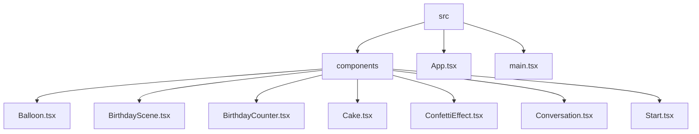

# Birthday Wish 🎉

## 🗂️ Description

Sree Birthday is a personalized birthday celebration application built with React, Vite, and TypeScript. This project allows users to create a customized birthday experience with interactive components, animations, and a conversational interface. It's perfect for anyone looking to create a unique and memorable birthday celebration for their loved ones.

The application features a range of components, including a birthday scene with balloons, a cake, and a card, as well as a conversation interface that guides the user through a series of interactions. With its modular design and reusable components, Sree Birthday is an ideal project for developers looking to build a similar application.

## ✨ Key Features

### 🎂 Birthday Scene

* Interactive birthday scene with balloons, cake, and card
* Customizable components for a personalized experience

### 💬 Conversation Interface

* Conversational interface with a bot that guides the user through a series of interactions
* User responses through button clicks

### 🎉 Animations and Effects

* Confetti animation for a celebratory feel
* Flame animation on the birthday cake

### 📊 Counter and Timer

* Birthday counter that increments to a target age
* Accompanied by a confetti animation

## 🗂️ Folder Structure

## 🛠️ Tech Stack

## ⚙️ Setup Instructions

To run the project locally, follow these steps:

* Git clone the repository: `https://github.com/TriDEntApollO/Sree-Birthday.git`
* Install dependencies: `npm install`
* Start the development server: `npm run dev`

## 📝 Configuration Files

The project uses the following configuration files:

* `tsconfig.json`: Main TypeScript configuration file
* `tsconfig.app.json`: TypeScript configuration file for the application
* `tsconfig.node.json`: TypeScript configuration file for Node.js
* `vite.config.ts`: Vite configuration file
* `eslint.config.js`: ESLint configuration file

## 🤖 GitHub Actions

The project uses GitHub Actions for continuous integration and deployment. The workflow is defined in the `.github/workflows/main.yml` file.

## 📦 Dependencies

The project depends on the following packages:

* `react`: JavaScript library for building user interfaces
* `react-dom`: React library for building user interfaces
* `vite`: Development server and build tool
* `typescript`: TypeScript compiler and type checker
* `tailwind-css`: Utility-first CSS framework

## 💻 Code Quality

The project uses ESLint for code quality and linting. The configuration file is located at `eslint.config.js`.

  

<h3>Trident Apollo</h3>

Linux enthusiast and cybersecurity advocate, skilled in low-level programming, seeking to automate and debug with passion for Arch Linux.

 

  <a href="https://gitfull.vercel.app">Made by GitFull</a>

    
